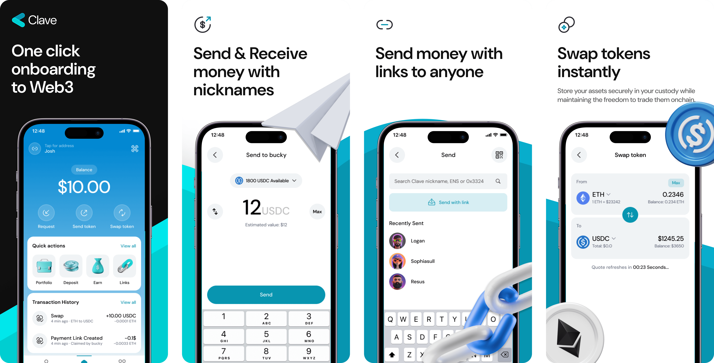

# Clave

One-click onboarding to onchain payments. Experience smartest self-custody and hardware-level security. Backed by [Matter Labs](https://matter-labs.io/) and Ethereum Foundation (ERC-4337 Team) Grantee.

## Welcome to Clave!

Clave is a self-custodial smart wallet powered by ZKsync, designed to deliver a seamless, user-friendly financial experiences with zero gas fees. With Clave, crypto becomes accessible to everyone.

## What Clave Offers?

### ⏩ One-Click Onboarding

### 🆓 Gasless Transactions

### 💰 Yield Opportunities

### 🔗 Sending tokens with links

### 1️⃣ Everything is one-click

## Useful Link:

Download Clave - https://getclave.io/download

Clave Documentation - https://docs.getclave.io
