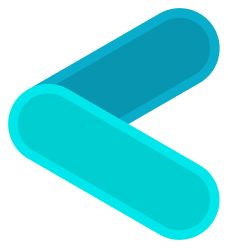

# Clave

Forget private keys and seed phrases. Embrace Account Abstraction storing keys on hardware for the easiest access to the future of finance.

## What is Clave?

Clave is an easy-to-use non-custodial smart wallet powered by Account Abstraction and the Hardware Elements (e.g Secure Enclave, Android Trustzone etc.), offering a unique onboarding process.

## What is Account Abstraction?

Account Abstraction is an improvement on Ethereum that has been developed for years, enabling smart contracts to be used as a wallet, thus bringing many different new features.

## What is Secure Enclave?

The Secure Enclave is a dedicated secure subsystem integrated into Apple systems on chip (SoCs). The Secure Enclave is isolated from the main processor to provide an extra layer of security and is designed to keep sensitive user data secure even when the Application Processor kernel becomes compromised.

## How can I use Clave?

Clave is currently under development. Please join the waitlist with your e-mail address to be informed about all the innovations and to be one of the first to use the application when it goes live. Also, don't forget to follow our X (formerly Twitter) account so you don't miss the news!

## Is Clave secure?

Clave is an application that turns your everyday device into a hardware wallet. No software or malicious actors can export your private key.
